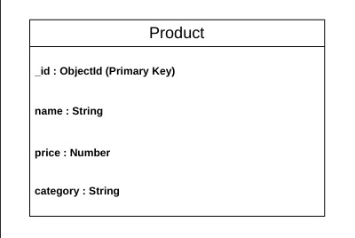

# PahadiKart

## A responsive Direct-to-Consumer (D2C) web application developed for HimShakti Food Processing Unit, enabling customers to browse authentic Himalayan food products, manage a shopping cart, receive AI-based product recommendations, and place orders through WhatsApp. The project also includes a RESTful backend API for product management.

### Prerequisites

Before running the backend, make sure you have:

- Node.js (v16 or later recommended)
- npm (comes with Node.js)
- Git (optional, for cloning the repository)

## Tech Stack

### Frontend

- React.js (Vite)
- React Router DOM
- JavaScript (ES6+)
- HTML5
- CSS3 (Custom CSS)
- Tailwind CSS (Selective UI Utilities)

### Backend

- Node.js
- Express.js
- MongoDB Atlas
- Mongoose
- CORS
- Dotenv
- Nodemon


### Tools & Design

- Figma
- Git
- GitHub
- WhatsApp API

---

## Database Choice

This project uses **MongoDB Atlas** as the database and **Mongoose** as the Object Data Modeling (ODM) library.

MongoDB was selected because it is a NoSQL database that stores data in flexible JSON-like documents. It integrates smoothly with the Node.js and Express.js backend and is suitable for managing product data in this D2C application.

The database stores product details such as product name, price, and category. The REST API performs CRUD operations directly on the MongoDB database.

---

## Schema Diagram

The application currently uses one main entity: **Product**.



---

## How to Run Backend Locally

### 1. Navigate to the backend folder

```bash
cd backend
```

### 2. Install dependencies

```bash
npm install
```

### 3. Create a `.env` file

Create a `.env` file using the values from `.env.example`.

Example:

```env
PORT=5000
```

### 4. Start the backend server

```bash
npm run dev
```

### 5. Server URL

```
http://localhost:5000
```

---

## Set Up the Database

### 1. Create a MongoDB Atlas Account

Create a free MongoDB Atlas account and create a cluster.

### 2. Create a Database User

Go to **Database Access** in MongoDB Atlas and create a database username and password.

### 3. Allow Network Access

Go to **Network Access** and add your current IP address.

For development purposes, you can allow access from all IP addresses:

```text
0.0.0.0/0
```

### 4. Get the MongoDB Connection String

Open your MongoDB Atlas cluster, click **Connect**, select **Drivers**, and copy the connection string.

Replace the username, password, and database name before using it in the project.

### 5. Update the `.env` File

Inside the `backend` folder, create or update the `.env` file:

```env
PORT=5000
MONGO_URI=mongodb+srv://<username>:<password>@cluster0.xxxxx.mongodb.net/pahadikart?retryWrites=true&w=majority
```

### 6. Start the Backend Server

```bash
cd backend
npm install
npm run dev
```

After the server starts successfully, the backend connects to MongoDB Atlas. The product API endpoints can then create, read, update, search, and delete product data from the database.

---

## API Endpoints

| Method | Endpoint                         | Description                |
| ------ | -------------------------------- | -------------------------- |
| GET    | `/api/products`                  | Retrieve all products      |
| GET    | `/api/products/:id`              | Retrieve a product by ID   |
| POST   | `/api/products`                  | Create a new product       |
| PUT    | `/api/products/:id`              | Update an existing product |
| DELETE | `/api/products/:id`              | Delete a product           |
| GET    | `/api/products/search?q=keyword` | Search products by keyword |
