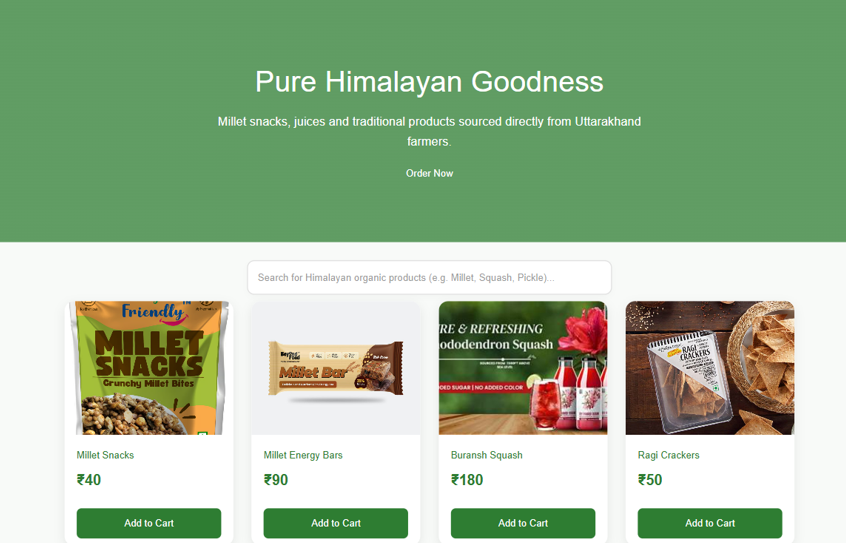
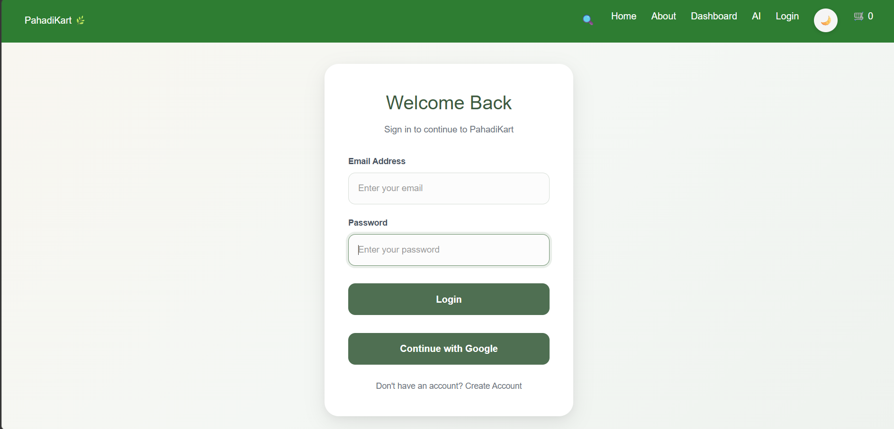
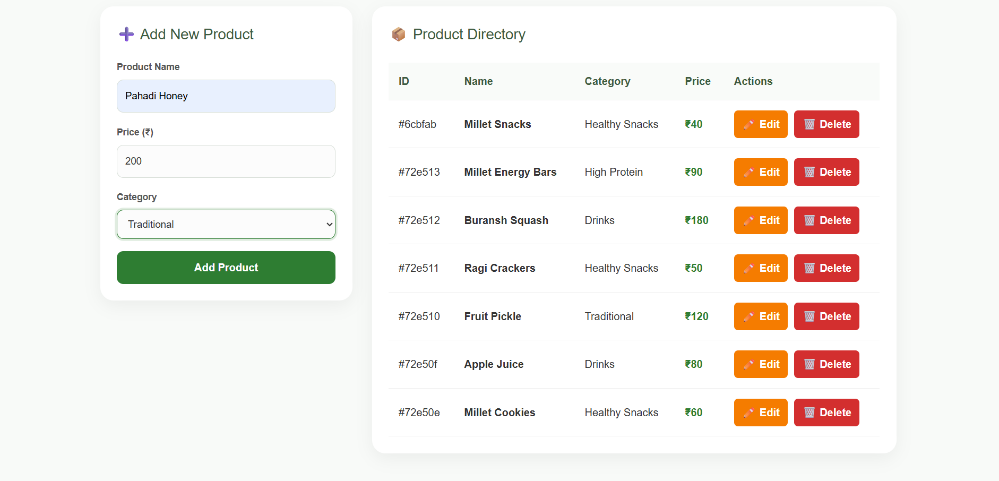
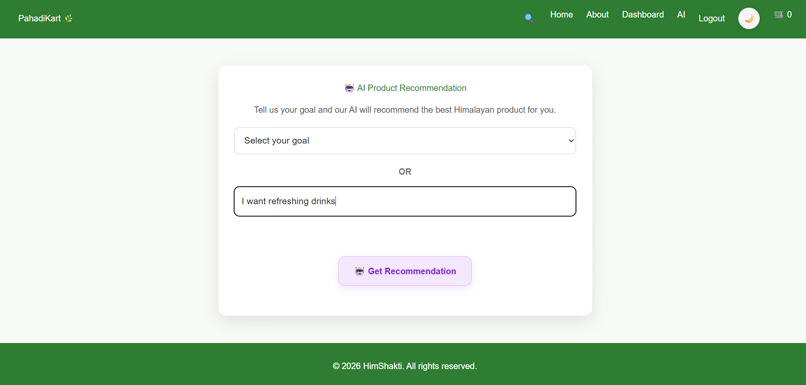

# PahadiKart

## A responsive Direct-to-Consumer (D2C) web application developed for HimShakti Food Processing Unit, enabling customers to browse authentic Himalayan food products, manage a shopping cart, receive AI-powered product recommendations, and place orders through WhatsApp. The project includes a RESTful backend API with authentication and AI recommendation support.

---

## Features

- Browse authentic Himalayan food products
- Search products by keyword
- Shopping cart with quantity management
- AI-powered product recommendations
- Loading and error handling for AI recommendations
- Secure user authentication using JWT
- WhatsApp order integration
- RESTful CRUD API for product management

---

## Tech Stack

### Frontend

- React.js (Vite)
- React Router DOM
- JavaScript (ES6+)
- HTML5
- CSS3 (Custom CSS)
- Tailwind CSS (Selective UI Utilities)

### Backend

- Node.js
- Express.js
- MongoDB Atlas
- Mongoose
- JWT Authentication
- bcryptjs
- CORS
- Dotenv
- Nodemon

### Prerequisites

Before running the backend, make sure you have:

- Node.js (v16 or later recommended)
- npm (comes with Node.js)
- Git (optional, for cloning the repository)

### Tools & Design

- Figma
- Git
- GitHub
- WhatsApp API

---


## Database Choice

This project uses **MongoDB Atlas** as the database and **Mongoose** as the Object Data Modeling (ODM) library.

MongoDB was selected because it is a NoSQL database that stores data in flexible JSON-like documents. It integrates smoothly with the Node.js and Express.js backend and is suitable for managing product data in this D2C application.

The database stores product details such as product name, price, and category. The REST API performs CRUD operations directly on the MongoDB database.

---

## Schema Diagram

The application currently uses one main entity: **Product**.


---

## How to Run Backend Locally

### 1. Navigate to the backend folder

```bash
cd backend
```

### 2. Install dependencies

```bash
npm install
```

### 3. Create a `.env` file

Create a `.env` file using the values from `.env.example`.

Example:

```env
PORT=5000
```

### 4. Start the backend server

```bash
npm run dev
```

### 5. Server URL

```
http://localhost:5000
```

---

## Set Up the Database

### 1. Create a MongoDB Atlas Account

Create a free MongoDB Atlas account and create a cluster.

### 2. Create a Database User

Go to **Database Access** in MongoDB Atlas and create a database username and password.

### 3. Allow Network Access

Go to **Network Access** and add your current IP address.

For development purposes, you can allow access from all IP addresses:

```text
0.0.0.0/0
```

### 4. Get the MongoDB Connection String

Open your MongoDB Atlas cluster, click **Connect**, select **Drivers**, and copy the connection string.

Replace the username, password, and database name before using it in the project.

### 5. Update the `.env` File

Inside the `backend` folder, create or update the `.env` file:

```env
PORT=5000
MONGO_URI=mongodb+srv://<username>:<password>@cluster0.xxxxx.mongodb.net/pahadikart?retryWrites=true&w=majority
```

### 6. Start the Backend Server

```bash
cd backend
npm install
npm run dev
```

After the server starts successfully, the backend connects to MongoDB Atlas. The product API endpoints can then create, read, update, search, and delete product data from the database.

---

# Folder Structure

```text
HIMSHAKTI/
│── backend/
│── frontend/
│── screenshots/
│   ├── home.png
│   ├── login.png
│   ├── dashboard.png
│   └── ai-feature.png
│── PROMPTS.md
│── README.md
│── W5_SchemaDiagram_26101026.png
```

---

## API Endpoints

| Method | Endpoint                         | Description                |
| ------ | -------------------------------- | -------------------------- |
| GET    | `/api/products`                  | Retrieve all products      |
| GET    | `/api/products/:id`              | Retrieve a product by ID   |
| POST   | `/api/products`                  | Create a new product       |
| PUT    | `/api/products/:id`              | Update an existing product |
| DELETE | `/api/products/:id`              | Delete a product           |
| GET    | `/api/products/search?q=keyword` | Search products by keyword |

---

# Deployment Documentation

## Live Demo

- **Frontend (Vercel):** https://my-project-1-ten-phi.vercel.app

- **Backend (Render):** https://himshakti-backend-iqbw.onrender.com

## Deployment Tech Stack Summary

| Layer | Technology |
|-------|------------|
| Frontend | React (Vite), React Router DOM, Tailwind CSS |
| Backend | Node.js, Express.js |
| Database | MongoDB Atlas |
| Authentication | JWT, bcryptjs, Google OAuth |
| AI | Google Gemini API |
| Deployment | Vercel (Frontend), Render (Backend) |

---

## Known Limitations on Free Tier

- **Render Free Tier** automatically spins down after approximately **15 minutes of inactivity**.
- The **first request after the backend has been idle may take 30–60 seconds** while the server wakes up.
- MongoDB Atlas Free Tier has storage and connection limits.
- The AI recommendation feature depends on the available Gemini API quota. If the free quota is exceeded, AI recommendations may temporarily fail until the quota resets.

---

# Authentication

The application uses **JWT (JSON Web Token)** authentication for secure user login and protected routes. Passwords are securely hashed using **bcryptjs** before being stored in MongoDB. Google OAuth authentication is also integrated to allow users to sign in with their Google accounts.

---

# AI Recommendation Feature

The application includes an AI-powered recommendation system that suggests suitable Himalayan food products based on user preferences. The feature is integrated with the backend API and uses the Google Gemini API to generate personalized product recommendations. Loading states and error handling are implemented to provide a smooth user experience.

---

# Environment Variables

## Backend (`backend/.env`)

```env
PORT=5000
MONGO_URI=your_mongodb_connection_string
JWT_SECRET=your_jwt_secret
GOOGLE_CLIENT_ID=your_google_client_id
GOOGLE_CLIENT_SECRET=your_google_client_secret
FRONTEND_URL=http://localhost:5173
```

## Frontend (`frontend/.env`)

```env
VITE_API_URL=http://localhost:5000
```

**Note:** Never commit your actual `.env` file or API keys to GitHub.

---

# Screenshots

## Home Page



---

## Login Page



---

## Product Dashboard



---

## AI Recommendation Feature



---

# Future Scope

The project can be enhanced with the following features in future versions:

- Secure online payment gateway integration (Razorpay/Stripe)
- Order history and order tracking for users
- Product ratings and customer reviews
- Admin dashboard with sales analytics and reports
- Inventory and stock management system
- Email and SMS notifications for order updates
- Wishlist and favorite products functionality
- Multi-language support for a wider user base
- Personalized AI recommendations based on purchase history
- Mobile application for Android and iOS

---

# Author

**Priyancy Bhandari**

- B.Tech Computer Science Engineering
- Graphic Era University
- GitHub: https://github.com/02-pb
- LinkedIn: https://www.linkedin.com/in/pb020105/